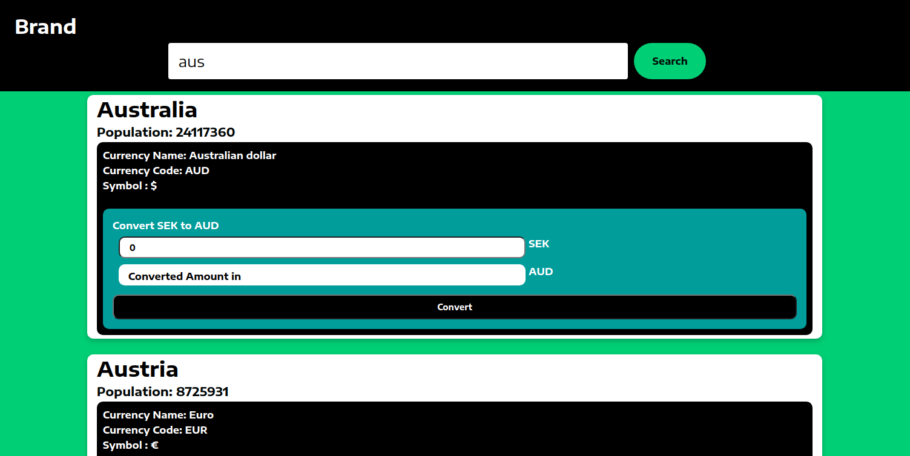

### Get Started

* Start node service https://github.com/sumitbopche01/node-demo before proceeding.



```
npm install
npm start
```

 * Sign up or use sumit as username and abs as password to login
 * Search country name
 * Enter amount which is in SEK then click on convert to get equivalent amount in resp. country's official currency
